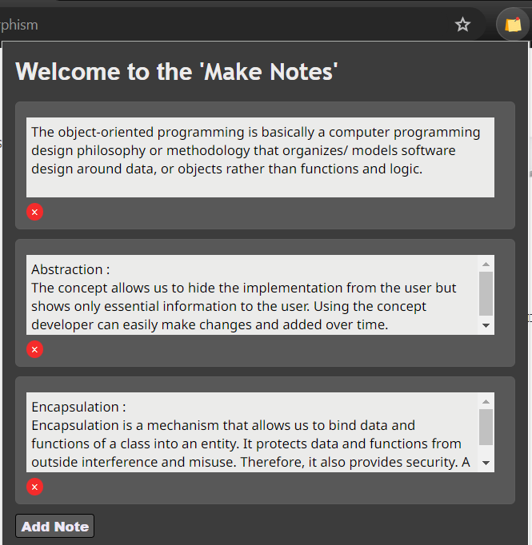
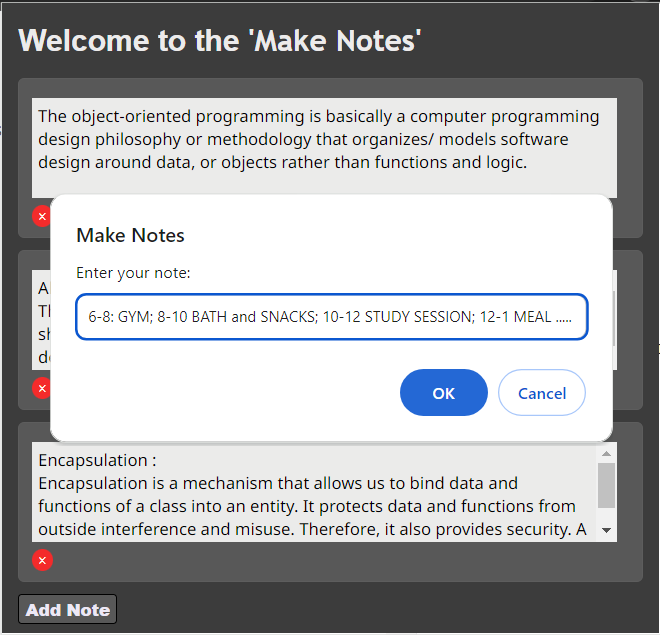
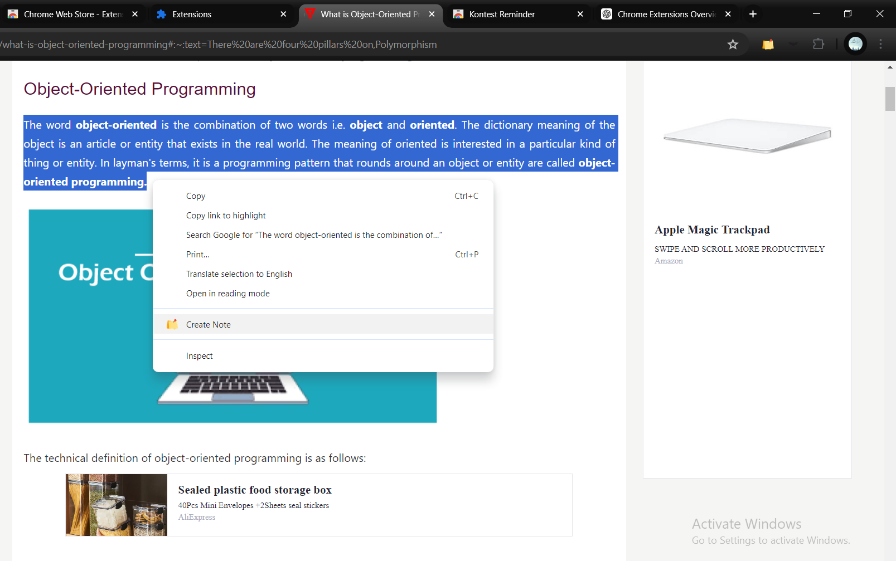

# Make Notes (Chrome Extension)

## Overview

**Make Notes** is a Chrome extension that allows users to create, manage, and delete notes directly within their browser. This extension is designed to be user-friendly and efficient, providing persistent storage and a responsive interface.





## Features

- **Note Creation**: Quickly create new notes with a simple click.
- **Note Management**: Easily edit and delete existing notes.
- **Persistent Storage**: Notes are saved across browser sessions using `chrome.storage.local`.
- **Responsive UI**: The interface is designed to be responsive, ensuring a seamless user experience on different screen sizes.

## Installation

To install the Make Notes Chrome extension:

**Clone the Repository**:
   ```sh
   git clone https://github.com/sirish20/Make-Notes.git
   cd Make-Notes

## Contact

For any questions or feedback, please contact **shubhamsangale20032003@gmail.com**

